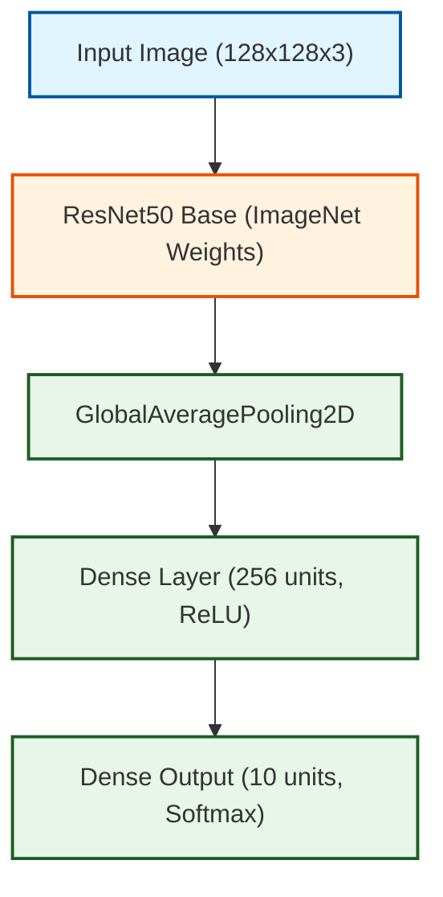

# ResNet50 Transfer Learning on CIFAR-10

This project contains a Jupyter notebook experiment for training, fine-tuning, evaluating, and documenting a ResNet50-based image classifier on the CIFAR-10 dataset using TensorFlow/Keras.

The notebook uses an ImageNet-pretrained ResNet50 convolutional base, adds a small classification head for CIFAR-10, trains the head with the base frozen, fine-tunes the final ResNet50 layers, evaluates the model with classification metrics, and saves visual artifacts for analysis.

## Project Structure

```text
.
├── README.md
├── requirements.txt
├── report.pdf
├── resnet50.ipynb
└── images/
    ├── accuracy_plot.png
    ├── confusion_matrix.png
    ├── finetune_accuracy_plot.png
    ├── finetune_loss_plot.png
    ├── hyperparameter_study.png
    ├── loss_plot.png
    ├── misclassified_images.png
    └── sample_images.png
```

## Main Notebook

The current notebook is:

```text
resnet50.ipynb
```

It performs the following workflow:

1. Imports TensorFlow, NumPy, Matplotlib, scikit-learn metrics, Seaborn, OS utilities, and archive utilities.
2. Creates the `images/` output directory if it does not already exist.
3. Checks whether TensorFlow detects a GPU.
4. Downloads and loads CIFAR-10 with `tf.keras.datasets.cifar10`.
5. Resizes images to 128x128 and normalizes them with ResNet50 preprocessing.
6. One-hot encodes labels for categorical crossentropy training.
7. Saves a sample image grid to `images/sample_images.png`.
8. Builds a ResNet50 transfer-learning classifier.
9. Trains the classification head for 10 epochs while the ResNet50 base is frozen.
10. Saves frozen-base accuracy and loss plots.
11. Fine-tunes the final 10 layers of ResNet50 for 5 more epochs.
12. Saves fine-tuning accuracy and loss plots.
13. Evaluates the final model with accuracy, macro precision, macro recall, macro F1-score, and a classification report.
14. Saves a confusion matrix and misclassified-image examples.
15. Runs a small hyperparameter comparison across learning rate, batch size, optimizer, dense layer size, and frozen-layer strategy.
16. Saves the hyperparameter comparison plot.
17. Creates an `images.zip` archive from the generated images.

## Dataset

The experiment uses CIFAR-10, a 10-class image classification dataset with:

- 50,000 training images
- 10,000 test images
- 32x32 RGB images
- 10 balanced classes

Class labels:

```text
airplane, automobile, bird, cat, deer, dog, frog, horse, ship, truck
```

TensorFlow downloads the dataset automatically on the first run.

## Model Architecture

The main classifier is built with:

- `tf.keras.applications.ResNet50`
- ImageNet pretrained weights
- `include_top=False`
- `input_shape=(128, 128, 3)`
- `GlobalAveragePooling2D`
- `Dense(256, activation="relu")`
- `Dense(10, activation="softmax")`



## Training Procedure

### Phase 1: Frozen ResNet50 Base

The ResNet50 base is frozen:

```python
base_model.trainable = False
```

Only the newly added classification head is trained.

Settings:

- Optimizer: Adam
- Learning rate: `0.001`
- Loss: categorical crossentropy
- Batch size: `64`
- Epochs: `8` (maximum, with early stopping patience=2)
- Validation data: 5,000 images held out from the training set

### Phase 2: Partial Fine-Tuning

The base model is made trainable, but only the final 10 layers are left unfrozen:

```python
base_model.trainable = True
for layer in base_model.layers[:-10]:
    layer.trainable = False
```

Settings:

- Optimizer: Adam
- Learning rate: `0.0001`
- Loss: categorical crossentropy
- Batch size: `64`
- Epochs: `4`
- Validation data: 5,000 images held out from the training set

## Recorded Results

The current notebook output reports this final evaluation after fine-tuning:

```text
Accuracy:  0.9067
Precision: 0.91
Recall:    0.91
F1-score:  0.91
```

The final recorded test accuracy is approximately 90.67%.

The frozen-base training phase reached a best recorded validation accuracy of approximately 89.18% at epoch 4 before early stopping. The fine-tuning phase further improved validation accuracy to a peak of 90.82%.

## Hyperparameter Study

The notebook includes a compact hyperparameter study (using short 2-epoch experiments). The tested settings and recorded validation accuracies are:

| Hyperparameter | Values | Observation |
| --- | --- | --- |
| Learning Rate | `0.001`, `0.0001` | `0.0001` performed slightly better (88.08% vs. 87.96%) |
| Batch Size | `32`, `64` | `32` performed slightly better (88.62% vs. 88.08%) |
| Optimizer | Adam, SGD | Adam slightly outperformed SGD (88.20% vs. 87.86%) |
| Dense Units | `128`, `256` | `128` dense units marginally outperformed `256` units (88.76% vs. 88.28%) |
| Frozen Layers | All Frozen, Partial | Partial unfreezing (fine-tuning) noticeably improved validation accuracy (90.24% vs. 88.74%) |

The plot is saved to:

```text
images/hyperparameter_study.png
```

## Generated Outputs

The notebook writes the following visual outputs to `images/`:

| File | Description |
| --- | --- |
| `images/sample_images.png` | Example CIFAR-10 images with labels |
| `images/accuracy_plot.png` | Training and validation accuracy for the frozen-base phase |
| `images/loss_plot.png` | Training and validation loss for the frozen-base phase |
| `images/finetune_accuracy_plot.png` | Training and validation accuracy during fine-tuning |
| `images/finetune_loss_plot.png` | Training and validation loss during fine-tuning |
| `images/confusion_matrix.png` | Confusion matrix over the CIFAR-10 test set |
| `images/misclassified_images.png` | Ten examples of incorrect predictions |
| `images/hyperparameter_study.png` | Bar charts comparing hyperparameter settings |

The final notebook cell creates:

```text
images.zip
```

This archive is generated from the current contents of the `images/` directory.

## Report

The folder also includes:

```text
report.pdf
```

Use this PDF as the written report for the experiment if you need a submitted or shareable document alongside the executable notebook.

## Setup

Create and activate a virtual environment:

```bash
python3 -m venv .venv
source .venv/bin/activate
```

Install Python dependencies:

```bash
pip install -r requirements.txt
```

Start JupyterLab:

```bash
jupyter lab
```

Open and run:

```text
resnet50.ipynb
```

Run the cells from top to bottom.


## Hardware Notes

The notebook can run on CPU, but ResNet50 training is much faster with a GPU.

The recorded notebook output shows TensorFlow detected a GPU:

```text
GPUs: [PhysicalDevice(name='/physical_device:GPU:0', device_type='GPU')]
```

For Apple Silicon GPU acceleration, install the Apple TensorFlow Metal plugin separately if it is compatible with your TensorFlow and Python versions:

```bash
pip install tensorflow-metal
```

Do not install `tensorflow-metal` on non-macOS systems.

## Reproducibility Notes

The notebook does not currently set random seeds, so results can vary between runs because of:

- random dense-layer initialization
- stochastic mini-batch ordering
- GPU kernel behavior
- TensorFlow/Keras version differences
- repeated fresh-model training in the hyperparameter study

For stricter reproducibility, set TensorFlow and NumPy seeds before creating any models.

## Interpretation Notes

This setup is useful for demonstrating transfer learning, fine-tuning, metric reporting, and experiment visualization. It is not an optimized CIFAR-10 classifier.

ResNet50 was designed for larger ImageNet-style inputs, while CIFAR-10 images are only 32x32. Better performance may require:

- resizing inputs before ResNet50
- applying `tf.keras.applications.resnet50.preprocess_input`
- adding data augmentation
- using callbacks such as `EarlyStopping` and `ReduceLROnPlateau`
- tuning the fine-tuning learning rate and number of trainable layers
- comparing against smaller CNNs designed for CIFAR-sized images
- saving the trained model with `model.save(...)` for later inference

## Dependencies

The project uses:

- TensorFlow/Keras for model creation, CIFAR-10 loading, training, evaluation, and architecture plotting
- NumPy for array operations
- Matplotlib for image grids and training plots
- scikit-learn for classification metrics and confusion matrix generation
- Seaborn for the confusion matrix heatmap
- pydot for Keras model diagram generation
- JupyterLab/IPython kernel for running the notebook