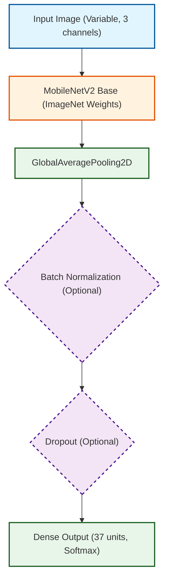

# MobileNetV2 Transfer Learning and CNN Study on Oxford-IIIT Pet

This project contains a Jupyter notebook experiment for training, fine-tuning, evaluating, and documenting a MobileNetV2-based image classifier on the Oxford-IIIT Pet dataset using TensorFlow/Keras and TensorFlow Datasets (TFDS).

The notebook conducts an extensive study on CNN design choices including weight initialization, regularization, optimizers, learning rate, batch size, and compares feature extraction with fine-tuning. It utilizes 5-fold stratified cross-validation to select the best hyperparameter configuration.

## Project Structure

```text
.
├── README.md
├── requirements.txt
├── report.pdf
├── mobilenetv2_cnn_study.ipynb
└── images/
    ├── 10_dropout_rate.png
    ├── 11_feature_extraction_vs_finetuning.png
    ├── 12_transfer_learning_loss.png
    ├── 13_cross_validation_accuracy.png
    ├── 14_confusion_matrix.png
    ├── 15_misclassified_images.png
    ├── 1_weight_init_loss.png
    ├── 2_weight_init_accuracy.png
    ├── 3_regularization_accuracy.png
    ├── 4_regularization_loss.png
    ├── 5_batch_normalization.png
    ├── 6_optimizers_loss.png
    ├── 7_optimizers_accuracy.png
    ├── 8_learning_rate.png
    └── 9_batch_size.png
```

## Main Notebook

The current notebook is:

```text
mobilenetv2_cnn_study.ipynb
```

It performs the following workflow:

1. Imports necessary libraries (TensorFlow, TFDS, NumPy, Pandas, Matplotlib, Scikit-learn).
2. Loads the Oxford-IIIT Pet dataset via `tensorflow_datasets`.
3. Preprocesses images (resizing, normalization).
4. Studies the effect of different weight initializations.
5. Studies the effect of regularization techniques (L2, Dropout).
6. Compares different optimizers (SGD, Momentum, RMSProp, Adam).
7. Conducts hyperparameter tuning for learning rate and batch size.
8. Compares Feature Extraction vs. Fine-Tuning.
9. Performs 5-fold stratified cross-validation to find the optimal configuration.
10. Trains the final model using the best configuration.
11. Evaluates the final model on the independent test set.
12. Generates and saves various plots and a confusion matrix to `images/`.

## Dataset

The experiment uses the Oxford-IIIT Pet dataset, loaded via TensorFlow Datasets.

- Classes: 37 different pet categories
- Preprocessing: Images are resized and normalized using MobileNetV2 preprocessing.

TensorFlow Datasets downloads the dataset automatically on the first run.

## Model Architecture

The main classifier is built with:

- `tf.keras.applications.MobileNetV2`
- ImageNet pretrained weights (for fine-tuning and feature extraction)
- `include_top=False`
- Custom classification head



## Generated Outputs

The notebook writes visual outputs to `images/`, capturing the results of the various studies and final evaluation (e.g. confusion matrix, weight initialization loss/accuracy, optimizer comparisons, etc.).

## Report

The folder also includes:

```text
report.pdf
```

Use this PDF as the written report for the experiment if you need a submitted or shareable document alongside the executable notebook.

## Setup

Create and activate a virtual environment:

```bash
python3 -m venv .venv
source .venv/bin/activate
```

Install Python dependencies:

```bash
pip install -r requirements.txt
```

Start JupyterLab:

```bash
jupyter lab
```

Open and run:

```text
mobilenetv2_cnn_study.ipynb
```

Run the cells from top to bottom.
